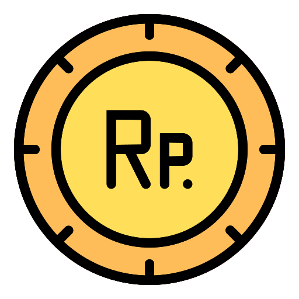

# FokusKripto

[](https://flutter.dev)
[](LICENSE)
[](https://flutter.dev)


---

## 🚀 Fitur Utama

- **Autentikasi**: Login manual & quick access via fingerprint (biometric).
- **Market**: Lihat harga, volume, dan perubahan koin kripto secara real-time.
- **Notifikasi**:
  - Notifikasi lokal untuk update harga market.
  - Reminder deposit/withdrawal.
- **Simulasi Trading**: Beli/jual koin, kelola wallet, dan pantau portofolio.
- **Profile**: Edit profil, upload foto, dan kelola data pribadi.
- **Sensor**: Fitur shake untuk mengacak urutan koin.
- **Reminders**: Notifikasi harga market terbaru setiap kali data di-fetch.
- **Keamanan**: Logout otomatis & fingerprint protection jika app lama tidak aktif.

---

## 🖼️ Screenshot

|        Login & Fingerprint         |              Market               |               Wallet                |
| :--------------------------------: | :-------------------------------: | :---------------------------------: |
|  |  |  |

> _Ganti screenshot di atas dengan tampilan aplikasi sesuai kebutuhan._

---

## 🗂️ Struktur Folder

```
lib/
  pages/         # Semua halaman utama (login, home, market, wallet, dsb)
  services/      # Service: API, provider, notification, cache, dsb
  model/         # Model data (CoinGecko, dsb)
  widgets/       # Widget custom (market, trade, profile, dsb)
assets/
  logo/          # Logo aplikasi
  fonts/         # Font custom (jika ada)
```

---

## ⚙️ Dependency Utama

- `provider` - State management
- `hive` & `hive_flutter` - Local storage
- `flutter_local_notifications` - Notifikasi lokal
- `local_auth` - Fingerprint/biometric
- `firebase_messaging` - (opsional) Push notification
- `sensors_plus` - Sensor device (shake)
- `geolocator`, `geocoding` - Lokasi
- `fl_chart` - Chart harga

---

## 🏁 Cara Menjalankan

1. **Clone repo & install dependencies**

   ```bash
   git clone <repo-url>
   cd fokuskripto
   flutter pub get
   ```

2. **Jalankan di emulator/device**

   ```bash
   flutter run
   ```

3. **(Opsional) Setup Firebase untuk push notification**

   - Buat project di [Firebase Console](https://console.firebase.google.com/)
   - Download `google-services.json` dan letakkan di `android/app/`
   - Tambahkan dependency `firebase_messaging` di `pubspec.yaml`
   - Ikuti [docs ini](https://firebase.flutter.dev/docs/messaging/overview/)

4. **(Opsional) Setup fingerprint di Android**

   - Pastikan `minSdkVersion` di `android/app/build.gradle` minimal 23
   - Edit `MainActivity` menjadi turunan `FlutterFragmentActivity`

5. **(Opsional) Setup permission notifikasi**
   - Pastikan permission notifikasi sudah diizinkan di device

---

## 🔒 Fitur Keamanan

- **Fingerprint Quick Access**: Jika user login & app dibuka setelah >5 detik, wajib fingerprint.
- **Force Logout**: Jika fingerprint gagal 5x atau user pilih login manual, user akan logout otomatis.

---

## 🔔 Notifikasi

- **Notifikasi lokal**:
  - Reminder update harga market setiap kali data di-fetch.
  - Reminder deposit/withdrawal sukses.
- **Push notification (opsional)**:
  - Bisa diaktifkan dengan integrasi FCM.

---

## 📝 Catatan Pengembangan

- Semua notifikasi terpusat di `lib/services/notification_service.dart`.
- Data market di-fetch dari CoinGecko API (`lib/services/api/coin_gecko_api.dart`).
- Fitur shake sensor diaktifkan di halaman market.
- Untuk pengembangan lebih lanjut, gunakan branch terpisah untuk fitur baru.

---

## 📄 Lisensi

MIT (atau sesuaikan dengan kebutuhanmu)

---

**Kontribusi, bug report, dan saran sangat diterima!**
